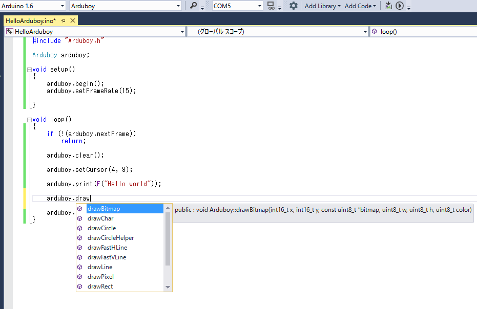
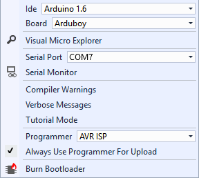

edit:
Add tips about `.vcxproj`.

Arduboy is a hardware development platform based on Arduino. And, there is Visual Studio plugin for Arduino development. If we can use this plugin, it is useful because we can use code completion.

[Arduino Plugin for Visual Studio](http://www.visualmicro.com/)

## Overview

1. Arduino IDE Setup
2. Visual Studio Community 2015 Setup with C++ component
3. Arduino Plugin for Visual Studio Setup
4. Open the sketch file of Arduboy
5. Build and upload
6. Tips

## Arduino IDE Setup

Arduino Plugin for Visual Studio use the toolset of Arduino IDE. We can setup Arduboy with Kickstarter Quick Start guide.

[Arduboy : Kickstarter Quick Start Guide](http://community.arduboy.com/t/kickstarter-quick-start-guide/725)

## Visual Stduio Community 2015 Setup with C++ component

Arduino Plugin will require **Visual C++** component. So we need to activate Visual C++  as an optional component during Visual Studio installation.

You will find **Visual C++** under the **Programming languages** section.

\# Sorry, I don't have a screenshot of this part.

If you already installed Visual Studio, you can add C++ component from control panel. (`Programs > Programs and Features > Microsoft Visual Studio` and click `Change` button)

Installation will take a very long time... Please wait a moment.

## Arduino Plugin for Visual Studio Setup

We can install plug-in from the following URL.

[Download Arduino for Visual Studio](http://www.visualmicro.com/page/Arduino-Visual-Studio-Downloads.aspx)

Please be careful, we need to install `Visual C++` component before this plug-in installation!
\# I explained it on the before part

## Open the sketch file of Arduboy

After plug-in installation, you will find "Arduino Project" item on `File > Open` menu.

You can open Arduino Sketch file (.ino) from this menu. After opening `.ino` file, the plug-in create `.vcxproj` and some files. If you want to keep clean the sample sketch folder, please copy it before opening `.ino` file.

After loading sketch file, we can open source code from solution explorer (right side bar). And code completion is available by default!


`.cpp` and `.h` files are also included to this project. You may find `*.vsarduino.h` file. According to the comment, this file will be ignored during compilation. Maybe this files does not affect upload size. I think that we should leave this file without manual changes.

## Build and upload

Configuration of build and upload is similar with Arduino IDE.

- Select target board type
- Select COM port


Second from left, we can select board type. Please select "Arduboy" from the list.

Left of board type, we can select COM port. Please select correct COM port of Arduboy.

To build project, we can start Build process from `vMicro > Build`. And we can upload sketch to Arduboy from `vMicro > Build & Upload`.

## Tips



#### Disabling Tutorial Mode

If build with Debug mode, step-in debugger will be executed automatically. To disable it, uncheck `vMicro > Tutorial Mode`.

#### Disabling Programmer

If you select wrong Programmer on vMicro menu, you can't upload sketch. To solve this issue, uncheck `vMicro > Always Use Programmer For Upload`.

#### Build error

Try to install "Arduboy" library from `vMicro > Add Library > User`.

#### Undefined error on source code editor

Maybe, some header files are missing. For example, in order to use the EEPROM variable in code completion, we must include the `eeprom.h`.

```cpp
#include <eeprom.h>
```

#### .vcxproj contains environment dependent paths

```
I received information via Twitter. Thanks @koteitan!
```

Please be careful before code distribution.

The `.vcxproj` file contains the environment dependent path. For example,

- Library path on `%AppData%`
- Sketch file's directory
- `%USERPROFILE%`\Documents\Arduino\libraries
- and Arduino IDE files on `%ProgramFiles(x86)%`

In `.vcxproj` file, above environment variables are extracted to actual paths. So user account name may be included in there. `%AppData%` contains Windows user accout name.

 I think that we should exclude the files which are created by Arduino Plugin.
 
 - *.sln
 - *.vcxproj
 - *.vcxproj.filters
 - __vm/
 - Debug
 - Release
 
Usually `.ino`, `.cpp` and `.h` are required for Arduino IDE.
